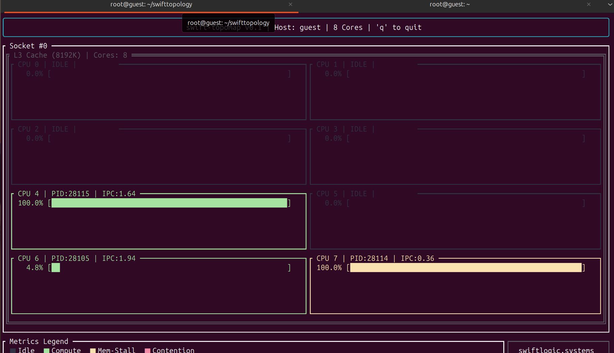

# swift-topomap

[](LICENSE)
[](https://swiftlogic.systems)
[]()

**swift-topomap** is a zero-dependency, high-performance TUI utility designed to visualize physical hardware topology while overlaying real-time microarchitectural metrics via eBPF.

Developed by [SwiftLogic Systems](https://swiftlogic.systems), it solves the "Observability Gap" by mapping software execution state directly onto the physical silicon layout.

## The "Aha!" Moment: Compute vs. Stall
Standard tools show CPU usage, but usage doesn't equal efficiency. **swift-topomap** uses hardware performance counters to distinguish between healthy calculation and memory bottlenecks:

*   **Emerald Green (Compute-Bound):** High IPC (Instructions Per Cycle). Your code is running efficiently.
*   **Amber Yellow (Memory-Bound):** High usage but low IPC. The core is "stalled" waiting for the L3 cache or RAM.



## Key Features
- **Deep Topology Resolution:** Native Rust parser for `sysfs`—no `libhwloc` or C-library dependencies.
- **Microarchitectural Metrics:** Real-time IPC, LLC (Last Level Cache) misses, and PID tracking.
- **eBPF CO-RE Engine:** High-efficiency kernel probes that run on any modern Linux kernel without header dependencies.
- **Statically Linked:** Available as a single `musl` binary for zero-friction deployment during live incident response.

## Tech Stack
- **Language:** Rust (TUI & Logic)
- **Kernel:** C / eBPF (CO-RE)
- **Frameworks:** Ratatui (Interface), libbpf-rs (Bridge)

## Installation (Zero-Friction)

Run the latest release on any bare-metal Linux server instantly:

```bash
curl -L -o topomap https://github.com/swiftlogicsystems/swifttopology/releases/latest/download/swift-topomap \
&& chmod +x topomap && sudo ./topomap
```

## Credits
Architecture design and kernel-level eBPF C code developed via **AI Pair Programming with Gemini**.

## About SwiftLogic Systems
SwiftLogic Systems specializes in deep-system observability and high-performance infrastructure. **swift-topomap** is our first open-source contribution toward making microarchitectural bottlenecks visible to every SRE and Developer.

Visit us at [swiftlogic.systems](https://swiftlogic.systems).
